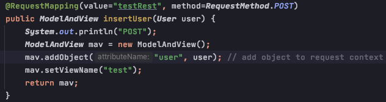
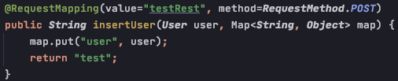
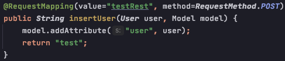
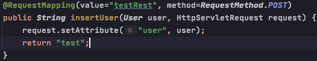
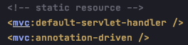
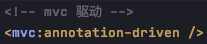
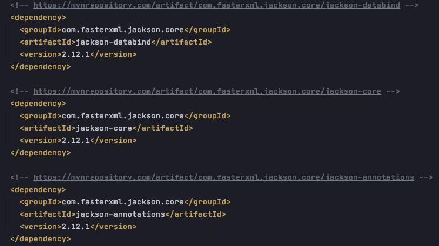
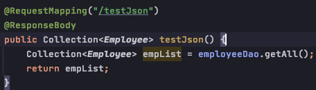

# SpringMVC

1. @RequestMapping

        - value : request url path, eg: "test" or "/test"
        - method: request method, eg: RequestMethod.GET, RequestMethod.POST, RequestMethod.PUT, RequestMethod.DELETE
        - params: {} set request parameters (data sent from client to server), support expression
        - 放在类上，相当于多添加了一层访问路径
        - 里面的参数越多，对request mapping的约束越多

2. @PathVariable 

3. 如果利用表单发送put 或 delete请求，须要做: 
    
        - 将HiddenHttpMethodFilter 添加到 web.xml

        - form表单中添加隐藏域 name="_method" value="PUT" 或 ”DELETE"

### Note: 如果使用ajax 发送请求就无须添加 HiddenHttpMethodFilter了，因为ajax自带8种请求方法的方式； 而form表单中只有两种请求方式(get / post), 无法发送put 或 delete 的请求，因此需要HiddenHttpMethodFilter，在servlet之前进行过滤 ~

4. 获取客户端的数据
    
        POST request: 

        方式 1: 在请求的方法中，加入响应的形参，保证形参的参数名和传递数据的参数名保持一致就可以自动赋值

    
        方式 2: 使用springMVC注解
    
            @RequestParam("xxx")String xxx 来接收参数
                - value: 当形参名和数据参数名不一致时，用value指定数据参数
                - required: 设置参数是否必须赋值，默认为true, 若设置为false， 则无需强制赋值
                - defaultValue: 若形参获得的值为null, 则可设置一个默认值

            @RequestParam(value="xxx", required=true/false, defaultValue="xxx")String xxx 获取请求头信息
        
            @CookieValue(value="xxx", required=true/false, defaultValue="xxx")String xxx 获取cookie信息
            
        方式 3: 使用一个 pojo 作为形参获取客户端数据，要求实体类中的属性名一定要和表单元素的数据属性名一致，且支持级联赋值 

        
        方式 4: 使用 javax.servlet原生 HttpServletRequest作为形参

5. 作用域放值 + 页面跳转

        方式 1: ModelAndView
            实现原理 (source code): 给request域存值 （request.setAttribute(key, value) + 页面跳转 (request.getRequestDispacher().forward(request, response)

        方式 2: Map<String Object> as parameter

        
        
        方式 3: Model model as parameter

    
        方式 4: 使用 javax.servlet原生 HttpServletRequest作为形参

6. 处理静态资源请求/访问

        - 在springMVC的配置文件中添加: (Tomcat中的default servlet) 

        - 当Tomcat default servlet 所设置的<url-pattern>的值与开发人员所配置的servlet的<url-pattern>的值
        相同时 (<url-pattern>/</url-pattern>)，以开发人员所配置的优先进行匹配; 因此先通过DispatcherServlet
        进行处理，有则处理，无则交给Tomcat DefaultServlet处理。

7. mvc驱动标签
    

        - 启动Tomcat Default Handler 处理静态资源请求
        - 启动 jackson 将java 对象转化成 json
        
        

8. JSON  操作

        - types: 
            - json object: {key1: val1, key2: val2}
            - json array: [{key1: val1, key2: val2}, {key3: val3, key4: val4}]
            
        - SpringMVC 对JSON的支持: 直接返回Java object
            - step 1: 开启 MVC 驱动

           - step2: 添加 Jackson jars

           - step3: 添加 @ResponseBody 在@controller方法上

